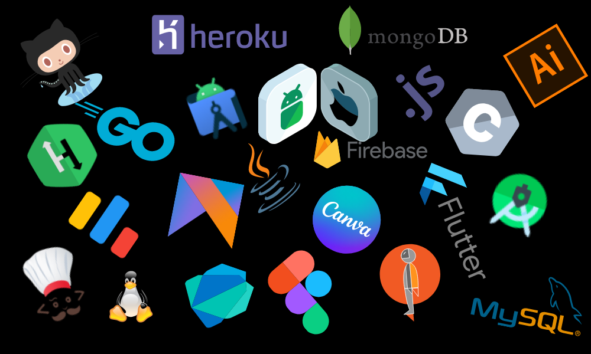

<!-- Matrix Gif Here -->

[](https://www.youtube.com/watch?v=SDkAGkd4NLc)

<!-- Greet Line Comes Here -->
<p align="center">
<a href="#"></a>
</p>

<!-- Coloured Line -->
<h3 align="center">

</h3>

<!-- Introduction Section Here -->
<h1 align="center">Hello  , I'm Chinmay Kaitade</h1>
<h3 align="center">A passionate Full Stack Developer from India 🇮🇳</h3>

<p align="center">
  <a href="https://github.com/kogutstt2"></a>
</p>

<!-- Coloured Lines -->
<h3 align="center">

</h3>

<!-- Animated Gif Here -->
<p align="center">
  
</p>

<!-- Coloured Line -->
<h3 align="center">

</h3>

<!-- About Me Section Here -->

## <picture></picture> *About Me*


- 😄 Pronouns: **He/His**

- 🌱 I’m currently working on **MERN Project**

- 🏆 I'm Interested in making the world better by **PRs**

- 👨‍🎓 Graduated in **Electrical Engineering 👨‍🔧⚡ @2022**

- 💬 Ask me about **about Web Development Stuffs**

- 📫 How to reach me chinmaykaitade123@gmail.com

- ⚡ Fun fact **Your Childhood Celebrity Crush❤‍🔥**

<!-- Coloured Line -->
<h3 align="center">

</h3>

<!-- Random Joke Section Here -->
<div align="center"> 
<i>Random dev joke for you!</i></br></br>

</div>

### A Little More About Me! 🧟‍♂️

```javascript
const chinmay = {
  askMeAbout: ["Web Dev", "Tech", "Editing"],
  code: [HTML5, CSS3, TailwindCSS, JavaScript, ReactJS, NodeJS, Express],
  tools: [React, Redux, Node, Styled-Components, Tailwind CSS],
  techCommunities: {
                           Google Crowdsource,
                           Github Developers Club,
                           Follow Me on Dribble, Stackoverflow and LinkedIn
                      },
  hobbies: {
               'Playing Games',
               'Tech Enthusiast'
               'Being up all Night Chasing that ONE BUG...'
           },

 challenge: ["I am Learning MERN Stack Development"],

 lastButNotLeast: ["Updating Myself Virtually and in Reality"]
}
```


<!-- Coloured Line -->
<h3 align="center">

</h3>

<!-- Connect With Me Section Here -->
<h1 align="left">🤞 Connect with Me</h1>
<p align="left">
<a href="https://dev.to/chinmaykaitade" target="blank"></a>
<a href="https://twitter.com/kaitadechinmay" target="blank"></a>
<a href="https://linkedin.com/in/chinmay-sharad-kaitade" target="blank"></a>
<a href="https://stackoverflow.com/users/23088119/chinmay-kaitade" target="blank"></a>
<a href="https://fb.com/hunterchinmay.kaitade?mibextid=zbwkwl" target="blank"></a>
<a href="https://instagram.com/chinmaykaitade_hunter" target="blank"></a>
<a href="https://dribbble.com/https://dribbble.com/chinmaykaitade" target="blank"></a>
<a href="https://medium.com/@chinmaykaitade123" target="blank"></a>
<a href="https://www.youtube.com/c/https://www.youtube.com/@chinmaykaitade" target="blank"></a>
<a href="https://www.leetcode.com/chinmaykaitade/" target="blank"></a>
</p>

<!-- Language and Tools Section Here -->
<h1 align="left">🛠 Language and Tools</h1>

<!-- Vector Tool Gif -->
<p align='center'>
</img></p>
<!-- Vector Tool Gif Ends -->

<p align="left"> <a href="https://appwrite.io" target="_blank" rel="noreferrer">  </a> <a href="https://www.arduino.cc/" target="_blank" rel="noreferrer">  </a> <a href="https://aws.amazon.com" target="_blank" rel="noreferrer">  </a> <a href="https://azure.microsoft.com/en-in/" target="_blank" rel="noreferrer">  </a> <a href="https://www.gnu.org/software/bash/" target="_blank" rel="noreferrer">  </a> <a href="https://www.blender.org/" target="_blank" rel="noreferrer">  </a> <a href="https://www.w3schools.com/css/" target="_blank" rel="noreferrer">  </a> <a href="https://www.docker.com/" target="_blank" rel="noreferrer">  </a> <a href="https://expressjs.com" target="_blank" rel="noreferrer">  </a> <a href="https://www.figma.com/" target="_blank" rel="noreferrer">  </a> <a href="https://firebase.google.com/" target="_blank" rel="noreferrer">  </a> <a href="https://cloud.google.com" target="_blank" rel="noreferrer">  </a> <a href="https://git-scm.com/" target="_blank" rel="noreferrer">  </a> <a href="https://www.w3.org/html/" target="_blank" rel="noreferrer">  </a> <a href="https://www.adobe.com/in/products/illustrator.html" target="_blank" rel="noreferrer">  </a> <a href="https://developer.mozilla.org/en-US/docs/Web/JavaScript" target="_blank" rel="noreferrer">  </a> <a href="https://kubernetes.io" target="_blank" rel="noreferrer">  </a> <a href="https://www.linux.org/" target="_blank" rel="noreferrer">  </a> <a href="https://www.mathworks.com/" target="_blank" rel="noreferrer">  </a> <a href="https://www.mongodb.com/" target="_blank" rel="noreferrer">  </a> <a href="https://www.mysql.com/" target="_blank" rel="noreferrer">  </a> <a href="https://nodejs.org" target="_blank" rel="noreferrer">  </a> <a href="https://www.photoshop.com/en" target="_blank" rel="noreferrer">  </a> <a href="https://www.postgresql.org" target="_blank" rel="noreferrer">  </a> <a href="https://postman.com" target="_blank" rel="noreferrer">  </a> <a href="https://www.python.org" target="_blank" rel="noreferrer">  </a> <a href="https://reactjs.org/" target="_blank" rel="noreferrer">  </a> <a href="https://redis.io" target="_blank" rel="noreferrer">  </a> <a href="https://redux.js.org" target="_blank" rel="noreferrer">  </a> <a href="https://www.sketch.com/" target="_blank" rel="noreferrer">  </a> <a href="https://tailwindcss.com/" target="_blank" rel="noreferrer">  </a> <a href="https://unity.com/" target="_blank" rel="noreferrer">  </a> <a href="https://www.adobe.com/products/xd.html" target="_blank" rel="noreferrer">  </a> </p>

<!-- Coloured Line -->
<h3 align="center">

</h3>

<!-- Tech Stack Section Here -->

# 💻 Tech Stack:

                

<h3 align="center">

</h3>

<!-- SkillSet Section Here -->

# 👨‍💻 My Skills Set:

<table><tr><td valign="top" width="33%">

## Frontend

<div align="center">  
<a href="https://reactjs.org/" target="_blank"></a>  
<a href="https://www.w3schools.com/css/" target="_blank"></a>  
<a href="https://en.wikipedia.org/wiki/HTML5" target="_blank"></a>  
<a href="https://www.javascript.com/" target="_blank"></a>  
<a href="https://www.adobe.com/in/products/illustrator.html" target="_blank"></a>  
<a href="https://www.tailwindcss.com/" target="_blank"></a>  
<a href="https://nodejs.org/" target="_blank"></a>  
<a href="https://www.adobe.com/in/products/indesign.html" target="_blank"></a>  
<a href="https://www.adobe.com/in/products/premiere.html" target="_blank"></a>  
<a href="https://expressjs.com/" target="_blank"></a>  
<a href="https://www.figma.com/" target="_blank"></a>  
<a href="https://www.arduino.cc/" target="_blank"></a>  
<a href="https://www.adobe.com/products/photoshop-lightroom.html" target="_blank"></a>  
<a href="https://www.adobe.com/in/products/aftereffects.html" target="_blank"></a>  
<a href="https://www.adobe.com/in/products/photoshop.html" target="_blank"></a>  
<a href="https://www.blender.org/" target="_blank"></a>  
<a href="https://www.adobe.com/in/products/xd.html" target="_blank"></a>  
<a href="https://wordpress.com/" target="_blank"></a>  
<a href="https://mui.com/" target="_blank"></a>  
<a href="https://www.python.org/" target="_blank"></a>  
</div>

</td><td valign="top" width="33%">

## Backend

<div align="center">  
<a href="https://www.javascript.com/" target="_blank"></a>  
<a href="https://www.mongodb.com/" target="_blank"></a>  
<a href="https://nodejs.org/" target="_blank"></a>  
<a href="https://www.linux.org/" target="_blank"></a>  
<a href="https://www.python.org/" target="_blank"></a>  
<a href="https://expressjs.com/" target="_blank"></a>  
<a href="https://redux.js.org/" target="_blank"></a>  
<a href="https://www.mysql.com/" target="_blank"></a>  
<a href="https://www.postgresql.org/" target="_blank"></a>  
<a href="https://azure.microsoft.com/en-in/" target="_blank"></a>  
<a href="https://reactjs.org/" target="_blank"></a>  
</div>

</td><td valign="top" width="33%">

## DevOps

<div align="center">  
<a href="https://aws.amazon.com/" target="_blank"></a>  
<a href="https://cloud.google.com/" target="_blank"></a>  
<a href="https://kubernetes.io/" target="_blank"></a>  
<a href="https://www.linux.org/" target="_blank"></a>  
<a href="https://github.com/" target="_blank"></a>  
<a href="https://www.gnu.org/software/bash/" target="_blank"></a>  
<a href="https://www.mysql.com/" target="_blank"></a>  
<a href="https://unity.com/" target="_blank"></a>  
<a href="https://www.postgresql.org/" target="_blank"></a>  
<a href="https://docs.microsoft.com/en-us/powershell/" target="_blank"></a>  
<a href="https://about.gitlab.com/" target="_blank"></a>  
<a href="https://www.arduino.cc/" target="_blank"></a>  
<a href="https://firebase.google.com/" target="_blank"></a>  
<a href="https://azure.microsoft.com/en-in/" target="_blank"></a>  
<a href="https://www.docker.com/" target="_blank"></a>  
<a href="https://redis.io/" target="_blank"></a>  
</div>

</td></tr></table>

<h3 align="center">

</h3>

<!-- GitHub Stats Section Here -->

# 📊 GitHub Stats

<hr>

|               |                                |
| -------------------------------------------------------------------------------------------------------------------------------------- | ------------------------------------------------------------------------------------------------------------------------------------------- |
|  |  |

<!-- color=nord_dark -->

<hr>

<p align="center">

</p>

<!-- Coloured Line -->
<h3 align="center">

</h3>

<!-- GitHub Contribution Section Here -->

## 📈 GitHub Contribution Graph

[](https://github.com/ChinmayKaitade/github-readme-activity-graph)

<hr>

<!-- Coloured Line -->
<h3 align="center">

</h3>

<!-- Trophies Section Here -->

## 🏆 GitHub Trophies


<!-- Random Quote Section Here -->

### ✍️ Random Dev Quote


<!-- Summary Section Here -->

## 💳 Github Profile Summary Card


<hr>
<br>

<div>

</div>

<h3 align="center">

</h3>

<div align="center">

</div>

<h3 align="center">

</h3>


###

<h3 align="center">

</h3>

[](https://spotify-github-profile.vercel.app/api/view?uid=ybli0il5ugmggwcqrfomuyt7e&redirect=true)


<h3 align="center">

</h3>

<div align="center">

### Made By ❤️ Chinmay Kaitade © Copyright. All Rights Reserved @2023.

</div>
