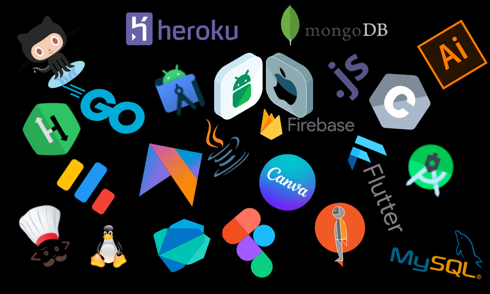

<h3 align="center">

</h3>

<h1 align="center">Hello  , I'm Chinmay Kaitade</h1>
<h3 align="center">An Aspiring passionate Full Stack Developer.</h3>

  

<h3 align="center">

</h3>

  

<h3 align="center">

</h3>

  

## <picture></picture> **About Me🫰**

- 😄 Pronouns: **He/His**

- 🌱 I’m currently learning **Full Stack Web Development**

- ✨ Skilled **Aspiring MERN Stack Developer**

- 👨‍🎓 Graduated in **Electrical Engineering👨‍🔧⚡ @2022**

- 💬 Ask me about **about Full Stack Development Stuffs**

- 📫 How to reach me **Checkout Social links given below**

- ⚡ Fun fact **Your Childhood Celebrity Crush❤‍🔥**

<h3 align="center">

</h3>

<h3 align="left">Connect with me:</h3>

<h3 align="left">Languages and Tools:</h3>

                

<h3 align="center">

</h3>

# 💻 Tech Stack:
                

<h3 align="center">

</h3>

<h3 align="center">

</h3>

# 📊 GitHub Stats:

|  |                                                                                                            |
| --------------------------------------------------------------------------------------------------------------------------------- | ----------------------------------------------------------------------------------------------------------------------------------------------------------------------------------------------------------------- |
|  |  

<!-- color=nord_dark -->

<h3 align="center">

</h3>

## 📈 GitHub Contribution Graph

<h3 align="center">

</h3>

## 🏆 GitHub Trophies

### ✍️ Random Dev Quote

## 💳 Github Profile Summary Card

 

<h3 align="center">

</h3>

<h3 align="center">

</h3>

  ## 💰 You can help me by Donating
     

### Made By ❤️ Chinmay Kaitade © Copyright. All Rights Reserved @2023.

